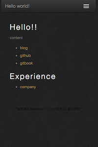

# readme



## about
Edit 'Markdown file' and upload，javascript will export html.

## file
- index.php : Main template
- index.md : Main content
- company.md : sub_content

## work

1. index.php parse index.md
2. `index.php?demo=company`
3. index.php : get `$_GET['demo']`
4. Auto put company.md to index.php

## video

```
<video width="500" src='./demoList/company/demo.mp3' controls></video>
```

and can use html5 to do your markdown website.
